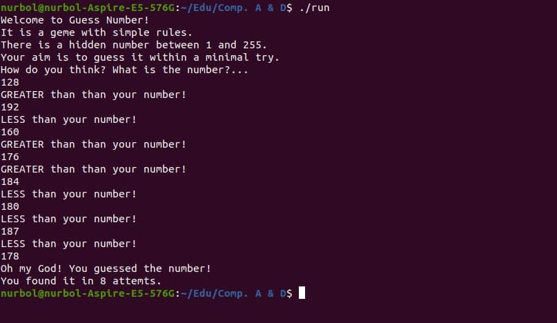

# Guess Number Game (NASM)
This is a simple command line game
where a player should guess the hidden number from 1 to 255
within a minimal try.
Written in **NASM** assembly language.

## How to run
In my machine `nasm -f elf64 guess-number-game.asm` &
`gcc -no-pie -o <output_name> guess-number-game.asm` commands were used to
make executable. `gcc` compiler is required. 
To start the game just type `./<output_name>` in terminal or 
_[run](./run)_ script can be used to compile end run (type `./run`).
My machine is *Linux Ubuntu 20.04 x64*.

## How to play
Computer generates a random number between **1** and **255**. 
Players aim is to find the hidden number by using **minimal attempts**.
Computer asks user to enter a number while the player guess the hidden number.
When the number is found, count of the player's attempts shown.

