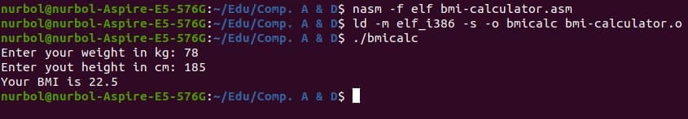

# BMI Calculator (NASM)
This is a simple command line application to calculate
body index mass (BMI) by provided *weight* and *height* of a person.
Written on **NASM** assembly language. 

## How to run
In my machine `nasm -f elf bmi-calculator.asm` & 
`ld -m elf_i386 -s -o <output_name> bmi-calculator.o` commands were used to
make executable. My machine is *Linux Ubuntu 20.04 x64*.

## How it works
Asks users _weight_ and _height_. Then by using the formula 
`bmi = height / weight^2` calculates the BMI and prints it.

